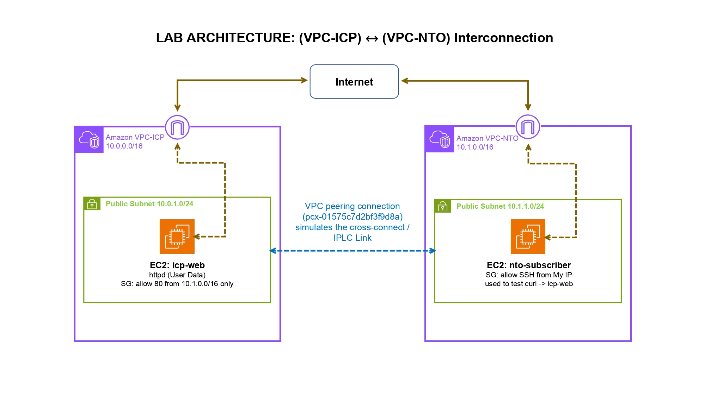

# vpc-interconnection-lab
AWS VPC Peering lab simulating cloud-telecom private interconnection

## Overview
A hands-on AWS VPC Peering lab that recreates, in miniature, a real
infrastructure pattern from my telecom career: an international cloud
provider colocating inside a national telecom operator's data center
and connecting to it via a private cross-connect rather than the
public internet. This lab rebuilds that same private-interconnection
model using two AWS VPCs joined by a VPC Peering Connection.

Throughout this document, ICP refers to a generalized International
Cloud Provider role, and NTO refers to a generalized National Telecom
Operator role, standing in for the real companies involved, which
are kept confidential.

## Architecture

- VPC-ICP (10.0.0.0/16) - simulates the cloud provider. Runs an
  EC2 web server (icp-web) whose Security Group only accepts port 80
  traffic from the NTO VPC's CIDR block, not from the open internet.
- VPC-NTO (10.1.0.0/16) - simulates the telecom operator. Runs a
  client EC2 instance (nto-subscriber) used to reach icp-web.
- VPC Peering Connection - the private link between the two VPCs,
  standing in for the physical cross-connect.

## What this proves
- Traffic reaches icp-web only over the private peering path, using
  private IP addresses, no public internet hop involved.
- icp-web's public IP is unreachable from the open internet by design
  (see screenshot), because the Security Group scopes HTTP access to
  the peer VPC's CIDR only.

## Steps taken
1. Created two non-overlapping VPCs (10.0.0.0/16 and 10.1.0.0/16).
2. Created a public subnet in each, with Internet Gateways and routing.
3. Created Security Groups, scoping icp-web's HTTP access to the
   NTO VPC's CIDR only.
4. Launched two EC2 instances (Amazon Linux, t2.micro), with the
   icp-web instance auto-configured via EC2 User Data.
5. Created and accepted a VPC Peering Connection between the two VPCs.
6. Updated both route tables to route to each other's CIDR via the
   peering connection.
7. Verified connectivity with curl from nto-subscriber to icp-web's
   private IP, and verified the public IP is correctly unreachable.

## Tools used
AWS VPC, Subnets, Internet Gateways, Route Tables, Security Groups,
EC2, VPC Peering Connections, EC2 Instance Connect.

## Screenshots
See /screenshots - includes both route tables, the active peering
connection, the security group rules, the successful curl output, and
the failed public-access attempt.

## What I'd add next
- A third VPC and a Transit Gateway, to show transitive routing beyond
  a single pair of VPCs (VPC Peering itself is non-transitive).
- Rebuild the same lab with Terraform, as my next infrastructure-as-
  code learning step.
